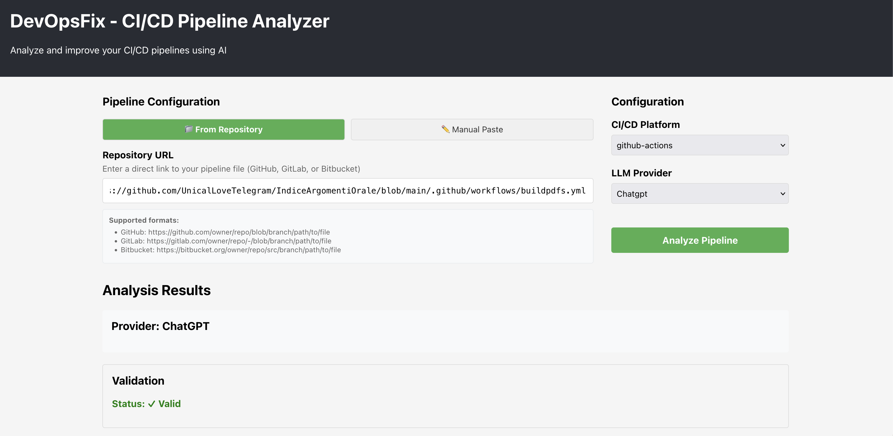
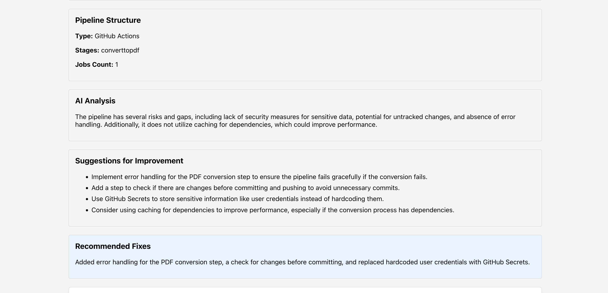
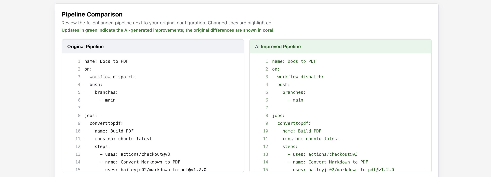

# DevOpsFix - CI/CD Pipeline Analyzer

DevOpsFix is a modern fullstack application that leverages Large Language Models (LLMs) to analyze, fix, and improve CI/CD pipelines. Built with extensibility in mind, it supports multiple CI/CD platforms and LLM providers, with the ability to easily add more as they emerge.





## Features

- **Repository Integration**: Fetch pipelines directly from GitHub, GitLab, or Bitbucket - no copy-paste needed!
- **Multi-Platform Support**: Analyze pipelines from GitHub Actions, GitLab CI, and Jenkins
- **Multiple LLM Providers**: Choose from ChatGPT, Claude, or Gemini for AI-powered analysis
- **Extensible Architecture**: Plugin-based system allows easy addition of new CI/CD tools and LLM providers
- **Auto-Detection**: Automatically detects CI/CD platform from repository file paths
- **Real-time Analysis**: Get instant feedback on your pipeline configuration
- **Validation & Suggestions**: Automatic validation with AI-generated improvement suggestions
- **Dual Input Modes**: Fetch from repository URLs or manually paste pipeline configurations
- **Browser-Stored API Keys**: Provide LLM keys in the UI and store them locally for static deployments

## Architecture

### Frontend (React + TypeScript)
- **Modern UI**: Clean, responsive interface built with React
- **Real-time Feedback**: Instant validation and analysis results
- **Configuration Panel**: Easy selection of CI/CD platform and LLM provider, plus local API key storage
- **Static Deployment Ready**: Direct browser calls to LLM APIs without a backend dependency

## Project Structure

```
devopsfix/
├── frontend/                 # React frontend
│   ├── src/
│   │   ├── components/      # React components
│   │   │   ├── PipelineInput.tsx
│   │   │   ├── ConfigurationPanel.tsx
│   │   │   └── ResultsDisplay.tsx
│   │   ├── analysis/        # Parsers/providers for in-browser analysis
│   │   ├── services/        # Frontend analysis/storage services
│   │   │   └── analysisService.ts
│   │   ├── types/           # TypeScript type definitions
│   │   │   └── index.ts
│   │   ├── App.tsx
│   │   └── App.css
│   └── package.json
│
└── README.md
```

## Getting Started

### Prerequisites

- Node.js 16+ and npm
- TypeScript knowledge (optional, for development)

### Installation

1. Clone the repository:
```bash
git clone https://github.com/umbertocicciaa/devopsfix.git
cd devopsfix
```

2. Install frontend dependencies:
```bash
cd frontend
npm install
```

### Running the Application

#### Development Mode

1. Start the frontend:
```bash
cd frontend
npm start
```
The frontend will run on http://localhost:3000

2. (Optional) Start the backend server if you need the API server for extension work:
```bash
cd backend
npm run dev
```

#### Production Mode

1. Build the frontend:
```bash
cd frontend
npm run build
```
Serve the `build` folder with a static server.

## Usage

### Option 1: Analyze from Repository (Recommended)

1. Open the application in your browser
2. Keep the **"📁 From Repository"** mode selected (default)
3. Enter the direct URL to your pipeline file:
   - **GitHub**: `https://github.com/owner/repo/blob/branch/.github/workflows/ci.yml`
   - **GitLab**: `https://gitlab.com/owner/repo/-/blob/branch/.gitlab-ci.yml`
   - **Bitbucket**: `https://bitbucket.org/owner/repo/src/branch/Jenkinsfile`
4. Choose your preferred LLM provider (ChatGPT, Claude, or Gemini)
5. The CI/CD platform will be auto-detected from the file path
6. Click "Analyze Pipeline" to get AI-powered analysis and suggestions

### Option 2: Manual Paste

1. Open the application in your browser
2. Click the **"✏️ Manual Paste"** button
3. Select your CI/CD platform (GitHub Actions, GitLab CI, or Jenkins)
4. Choose your preferred LLM provider (ChatGPT, Claude, or Gemini)
5. Paste your pipeline configuration in the text area
6. Click "Analyze Pipeline" to get AI-powered analysis and suggestions

## Example Repository URLs

### Real GitHub Workflows
```
https://github.com/actions/starter-workflows/blob/main/ci/node.js.yml
https://github.com/actions/starter-workflows/blob/main/ci/python-app.yml
https://github.com/actions/starter-workflows/blob/main/ci/docker-image.yml
```

### GitLab CI Examples
```
https://gitlab.com/owner/project/-/blob/main/.gitlab-ci.yml
```

### Bitbucket Pipelines
```
https://bitbucket.org/owner/repo/src/main/Jenkinsfile
```

## Example Pipeline Configurations (for Manual Paste)

### GitHub Actions Example
```yaml
name: CI
on: [push]
jobs:
  build:
    runs-on: ubuntu-latest
    steps:
      - uses: actions/checkout@v2
      - name: Run tests
        run: npm test
```

### GitLab CI Example
```yaml
stages:
  - build
  - test

build-job:
  stage: build
  script:
    - npm install
    - npm run build

test-job:
  stage: test
  script:
    - npm test
```

### Jenkins Example
```groovy
pipeline {
    agent any
    stages {
        stage('Build') {
            steps {
                sh 'npm install'
            }
        }
        stage('Test') {
            steps {
                sh 'npm test'
            }
        }
    }
}
```

## Extensibility

### Adding a New LLM Provider

1. Create a new provider class in `backend/src/providers/`:

```typescript
import { LLMProvider, LLMProviderConfig, LLMResponse } from '../interfaces/LLMProvider';

export class NewLLMProvider extends LLMProvider {
  constructor(config: LLMProviderConfig) {
    super(config);
  }

  getName(): string {
    return 'NewLLM';
  }

  async analyzePipeline(pipelineContent: string, cicdType: string): Promise<LLMResponse> {
    // Implement your LLM API call here
    return {
      suggestions: [],
      analysis: '',
      fixes: ''
    };
  }
}
```

2. Register it in `backend/src/utils/ProviderFactory.ts`:

```typescript
import { NewLLMProvider } from '../providers/NewLLMProvider';

// Add to the providers Map
['newllm', NewLLMProvider]
```

### Adding a New CI/CD Parser

1. Create a new parser class in `backend/src/parsers/`:

```typescript
import { CICDParser, ParsedPipeline } from '../interfaces/CICDParser';

export class NewCICDParser extends CICDParser {
  getName(): string {
    return 'New CI/CD Tool';
  }

  parse(content: string): ParsedPipeline {
    // Implement parsing logic
    return {
      type: 'New CI/CD Tool',
      stages: [],
      jobs: [],
      issues: []
    };
  }

  validate(content: string): { valid: boolean; errors: string[] } {
    // Implement validation logic
    return { valid: true, errors: [] };
  }
}
```

2. Register it in `backend/src/utils/ParserFactory.ts`:

```typescript
import { NewCICDParser } from '../parsers/NewCICDParser';

// Add to the parsers Map
['new-cicd', NewCICDParser]
```

## API Endpoints

### POST /api/analyze
Analyze a CI/CD pipeline configuration from manual input or repository URL.

**Request Body (Option 1 - Repository URL):**
```json
{
  "repositoryUrl": "https://github.com/owner/repo/blob/main/.github/workflows/ci.yml",
  "cicdType": "github-actions|gitlab-ci|jenkins|auto-detect",
  "llmProvider": "chatgpt|claude|gemini",
  "config": {
    "apiKey": "optional",
    "model": "optional",
    "temperature": 0.7,
    "maxTokens": 2000
  }
}
```

**Request Body (Option 2 - Manual Content):**
```json
{
  "pipelineContent": "string",
  "cicdType": "github-actions|gitlab-ci|jenkins",
  "llmProvider": "chatgpt|claude|gemini",
  "config": {
    "apiKey": "optional",
    "model": "optional",
    "temperature": 0.7,
    "maxTokens": 2000
  }
}
```

**Response:**
```json
{
  "success": true,
  "parsed": {
    "type": "string",
    "stages": ["stage1", "stage2"],
    "jobs": [],
    "issues": []
  },
  "validation": {
    "valid": true,
    "errors": []
  },
  "analysis": {
    "suggestions": [],
    "analysis": "string",
    "fixes": "string"
  },
  "provider": "string",
  "detectedCICDType": "string (only when using repositoryUrl)"
}
```

### GET /api/providers
Get list of available LLM providers.

**Response:**
```json
{
  "providers": ["chatgpt", "claude", "gemini"]
}
```

### GET /api/cicd-types
Get list of supported CI/CD platforms.

**Response:**
```json
{
  "cicdTypes": ["github-actions", "gitlab-ci", "jenkins"]
}
```

## Configuration

### Browser-Stored API Keys (Recommended)

Enter your LLM API keys directly in the frontend configuration panel. Keys are stored locally in your browser
storage so the static build can call the LLM APIs without relying on environment variables.

## Contributing

Contributions are welcome! The plugin architecture makes it easy to add new providers and parsers.

## Author

Umberto Domenico Ciccia
